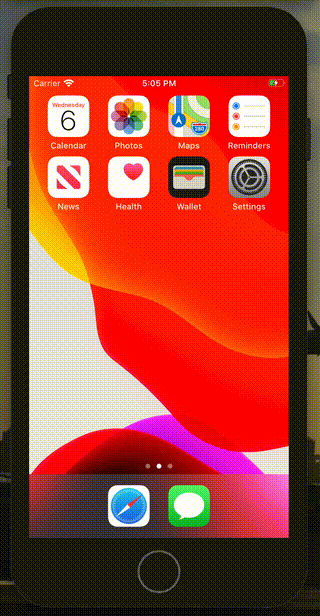

# TrainDelayReporter_iOS

## About

**TrainDelayReporter** is an app which tell you which train route has delayed.

Here's a just demo movie of alpha version.

[NOTE] This app is now not on AppStore.

## Architecture

We make reference from [this article](https://nalexn.github.io/clean-architecture-swiftui/) when we consider how we build the app based on which idea.

Thought result, we adopt this architecture.

Image from https://nalexn.github.io/clean-architecture-swiftui/

## Update History

| Version | Topic      | Date       |
| ------- | ---------- | ---------- |
| alpha.0 | Add README | 2020-04-26 |
|         |            |            |

## Requirements

* [SwiftUI](https://developer.apple.com/jp/xcode/swiftui/)
* [Combine](https://developer.apple.com/documentation/combine)
* [QGrid](https://github.com/Q-Mobile/QGrid)
* Icons in this app and AppIcon from [Icon8](https://icons8.com)

## Reference

* [鉄道遅延情報のJSON](https://rti-giken.jp/fhc/api/train_tetsudo/)

